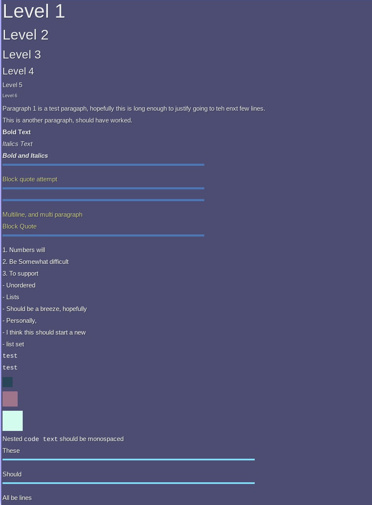

# Markdown2Formspec

A super simple mod to covert markdown text into part of a formspec, specifically a `hypertext[]` element.

There are two functions provided:

```lua
md2f(x,y,w,h,markdown_string)

md2ff(x,y,w,h,markdown_file)
```

Both will result in correctly formatted hypertext elements that match markdown output.

Notes:
1. All images will be centered
2. Images have extra syntax: `` will result in an image scaled to those provided dimensions in pixels.
3. Nesting is not supported at this time (such as headings inside block quotes)
4. ``` are supported, but they must begin a line to count. # headers and > quotes still work as normal, they just now would be monospaced. No background darkening used.
5. Headings are not auto-bolded or auto underlined

-----------------------------------------
-----------------------------------------

# Sample of tested and supported markdown:
```markdown
# Level 1
## Level 2
### Level 3
#### Level 4
##### Level 5
###### Level 6

Paragraph 1 is a test paragaph, hopefully this is long enough to justify going to teh enxt few lines.

This is another paragraph, should have worked.

**Bold Text**

*Italics Text*

***Bold and Italics***

> Block quote attempt

> Multiline, and multi paragraph
>
> Block Quote

1. Numbers will
3. Be Somewhat difficult
2. To support

- Unordered
- Lists
- Should be a breeze, hopefully
* Personally, 
* I think this should start a new 
* list set


`test`
`test`


Nested `code text` should be monospaced

These
--- 
Should
*** 
All be lines
_______

<htts://www.google.com>

----------
----------

```
# Output in formspec

